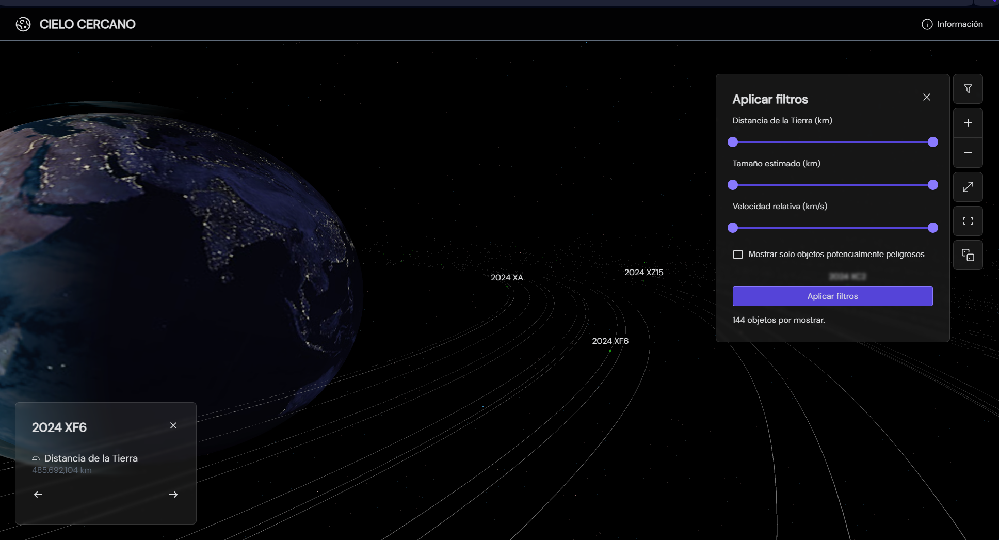

# Cielo Cercano

## Descripción

Este proyecto es una visualización interactiva en 3D de objetos cercanos a la Tierra (NEOs) con datos obtenidos de la API de NASA. Utiliza Three.js para renderizar la escena en un canvas WebGL y permite al usuario hacer clic en los NEOs para obtener información adicional.<br />
Se utilizaron conocimientos de **desarrollo web** para crear el frontend y conectar a la API y de **computación gráfica** para crear la escena 3D.<br />
Incluye:
* Animaciones en 3D con LookAt y Lerp (linear interpolation) 
* Filtros personalizables para visualizar datos, 
* Control total de la cámara
* Pantalla completa
* Centrar la camára
* Elegir un NEO aleatorio (de los datos filtrados aplicados).
* ...y más!



## Instalación y ejecución local

Para ejecutar este proyecto localmente:
1. Clona el repositorio en tu máquina local:
```bash
git clone https://github.com/Eliathx/cielo-cercano-webapp.git
```

2. Navega a la carpeta del proyecto e instala las dependencias utilizando npm:
```bash
cd cielo-cercano-webapp
npm install
```
3. Cambia el valor de la clave de API de NASA en el archivo `.env` (o directamente en `NeoDataContext.js`) para utilizar tu propia clave. (Puedes obtener una clave instantaneamente en la [página de NASA](https://api.nasa.gov/index.html#apply-for-an-api-key) o utilizar la API publica de [NASA Open APIs](https://api.nasa.gov/index.html#apply-for-an-api-key)).
3. Ejecuta el proyecto localmente:
```bash
npm run dev
``` 
4. Abre el navegador *(de preferencia incógnito - ver Nota adicional)* y accede a la dirección `http://localhost:3000/`.

## Tecnologías utilizadas

* **[Next.js:](https://nextjs.org/):** React Framework para crear aplicaciones web de alto rendimiento.
* **[Three.js:](https://threejs.org/)** Biblioteca para crear gráficos 3D en el navegador, junto a _CSS2DRenderer_ para renderizar elementos HTML en WebGL.
* **[Axios](https://axios-http.com/es/docs/intro):** Librería para peticiones a la API.
* **[NASA Open API - Asteroids - NeoWs:](https://api.nasa.gov/)** API de NASA para 
obtener datos de NEOs.
* iconoir-react para importar iconos SVG y slick-carousel que es un componente para sliders.

## ¿Quieres verlo en acción?
Visita https://cielo-cercano-webapp.vercel.app


## Retos y desafíos

* **Toggle de visibilidad de NEOs según el filtro:** Fue desafiante debido a que se utiliza CSS2DObject para representar las etiquetas, y tras leer más a detalle la documentación, noté que no se puede cambiar la visibilidad directamente como se hacia con los objetos 3D normales, pero se logró hacer con el atirbuto `hidden` de HTML.
* **Reestructuración del código:** al inicio el código utilizaba "prop drilling" para pasar datos entre componentes, pero poco después tuve que reestructurarlo para utilizar un contexto para compartir datos globales.
* **Demasiada responsabilidad en el componente SpaceCanvas:** el componente SpaceCanvas es responsable de manejar el estado de la cámara, el renderizado 3D de los NEOs, la animación del movimiento del puntero del mouse, etc. Esto puede realizarse con otros componentes, pero debido a la falta de tiempo, se optó por manejar todo el código en el componente SpaceCanvas.

## Nota adicional

Recomiendo utilizar modo incognito para ver el proyecto localmete, ya que Next.js puede mostrar "HydrationError" debido a extensiones de Chrome.